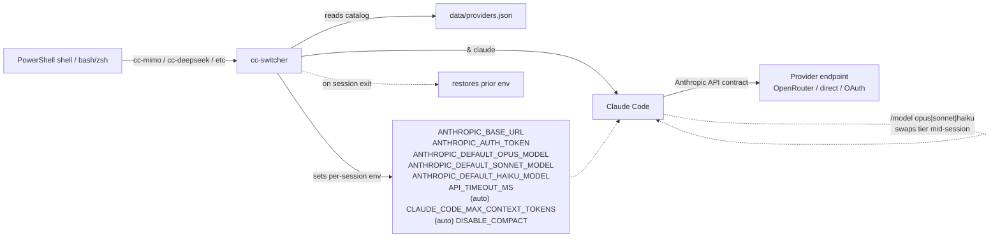
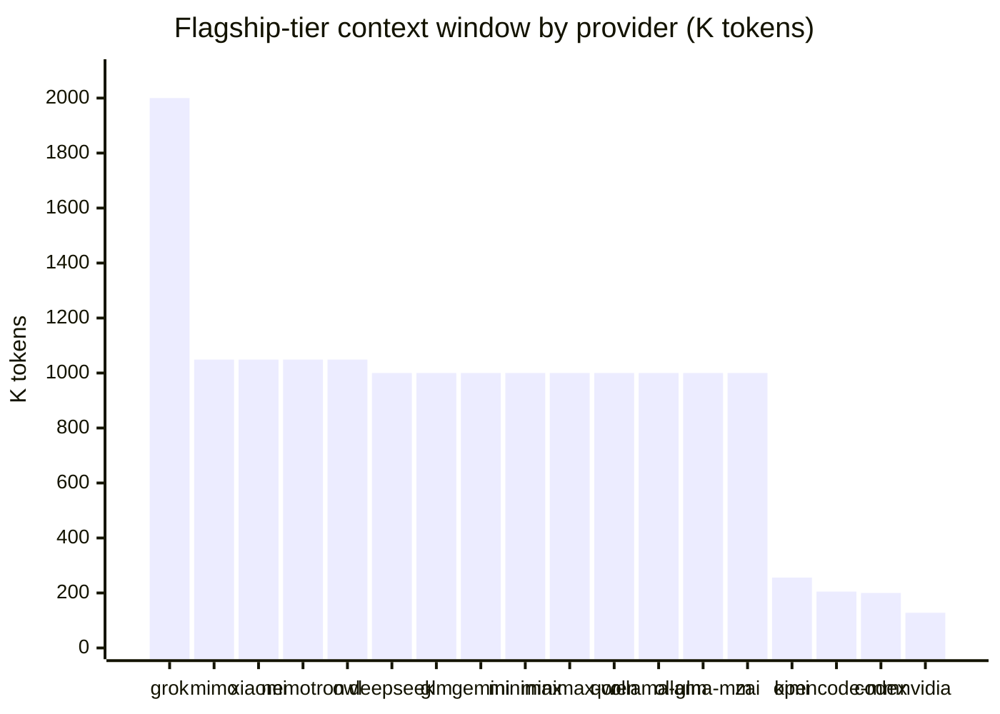

# cc-switcher

```text
   ┌──────────────────────────────────────────────────────────────┐
   │                                                              │
   │    ██████╗ ██████╗       ███████╗██╗    ██╗                  │
   │   ██╔════╝██╔════╝       ██╔════╝██║    ██║   PowerShell    │
   │   ██║     ██║     █████╗ ███████╗██║ █╗ ██║                  │
   │   ██║     ██║     ╚════╝ ╚════██║██║███╗██║   ↳ Claude Code  │
   │   ╚██████╗╚██████╗       ███████║╚███╔███╔╝     ↳ any LLM    │
   │    ╚═════╝ ╚═════╝       ╚══════╝ ╚══╝╚══╝                   │
   │                                                              │
   │    cc-switcher · v3.2.0  (PowerShell + Bash)                │
   │                                                              │
   └──────────────────────────────────────────────────────────────┘
```

[](https://github.com/jimstratus/cc-switcher/actions/workflows/ci.yml)
[](LICENSE)

> Multi-shell module for launching Claude Code against any Anthropic-compatible LLM provider — DeepSeek, MiMo, GLM, Qwen, MiniMax, Kimi, NVIDIA NIM, Codex, and more.

`cc-switcher` flips the `ANTHROPIC_*` environment variables that Claude Code reads on startup, points them at an alternative provider's Anthropic-compatible endpoint, and launches `claude` for you. When the session exits it restores the previous environment, so your shell never gets stuck on a non-default provider.

Available for both **PowerShell** (Windows/macOS) and **bash/zsh** (Linux/macOS). Both implementations share the same provider catalog and feature set.

It also tracks token usage per session, caches OpenRouter pricing, ships a doctor command for health checks, and provides tab completion for OpenRouter / OpenCode Go / NVIDIA NIM model IDs.

> Current release. Versions before 3.1.0 are summarized in `CHANGELOG.md`; public history starts at 3.1.0.

---

## How it works



Each provider command sets all three Claude Code tiers (Opus / Sonnet / Haiku) at once. `/model` switches between them in-session. For 1M-class flagships (DeepSeek, MiMo v2.5-Pro, Qwen3.6-Plus, Xiaomi MiMo v2.5-Pro), `cc-switcher` auto-derives `CLAUDE_CODE_MAX_CONTEXT_TOKENS` so Claude Code's status bar shows the model's full context window instead of the 200K default.

---

## Quick start

### PowerShell

```powershell
git clone https://github.com/jimstratus/cc-switcher.git
Import-Module .\cc-switcher\cc-switcher.psd1
```

Or add to your `$PROFILE` so it loads in every shell:

```powershell
Import-Module C:\path\to\cc-switcher\cc-switcher.psd1
```

Reload (`. $PROFILE`) and type `cc-help` for the full command list.

### bash / zsh (Linux / macOS)

```bash
git clone https://github.com/jimstratus/cc-switcher.git
source ./cc-switcher/bash/cc-switcher.sh
```

Or add to your `~/.bashrc` (or `~/.zshrc`) for persistence:

```bash
source /path/to/cc-switcher/bash/cc-switcher.sh
```

Or use the Makefile for a proper installation:

```bash
# User install (~/.cc-switcher)
make -C cc-switcher/bash install

# System-wide install (/usr/local/etc/cc-switcher)
sudo make -C cc-switcher/bash install-system
```

Run `cc-help` after sourcing to see all available commands.

---

## Usage

Each provider command sets all three Claude Code model tiers (Opus / Sonnet / Haiku) for that provider. Inside a session, use `/model opus|sonnet|haiku` to switch which tier the next turn uses.

### PowerShell

```powershell
cc-mimo                        # MiMo V2.5-Pro / V2.5 / V2-Flash via OpenRouter
cc-deepseek                    # DeepSeek V4-Pro / V4-Pro / V4-Flash (direct, 1M context)
cc-glm                         # GLM-5.1 via OpenRouter
cc-openrouter <model-id>       # any OpenRouter model
cc-nvidia                      # NVIDIA NIM defaults (free tier)
cc-yolo                        # native Anthropic + --dangerously-skip-permissions
cc-reset                       # clear overrides, restore native Anthropic
```

### bash / zsh

```bash
cc-mimo                        # MiMo V2.5-Pro / V2.5 / V2-Flash via OpenRouter
cc-deepseek                    # DeepSeek V4-Pro / V4-Pro / V4-Flash (direct, 1M context)
cc-glm                         # GLM-5.1 via OpenRouter
cc-openrouter <model-id>       # any OpenRouter model
cc-nvidia                      # NVIDIA NIM defaults (free tier)
cc-yolo                        # native Anthropic + --dangerously-skip-permissions
cc-reset                       # clear overrides, restore native Anthropic
```

Append `--yolo` to any `cc-*` command to launch with `--dangerously-skip-permissions`, or set `CC_YOLO=1` to apply it to every launch in the current shell.

---

## Providers

| Command | Provider | Tiers (flagship / standard / fast) |
|---|---|---|
| `cc-deepseek` | DeepSeek V4 (direct) | v4-pro / v4-pro / v4-flash |
| `cc-glm` | GLM-5.2 (OpenRouter) · **1M** | glm-5.2 / glm-5.2 / glm-4.7-flash |
| `cc-gemini` | Gemini 3.1 Pro (Google via OpenRouter) · **1M** | gemini-3.1-pro-preview (all three) |
| `cc-grok` | Grok 4.20 (xAI via OpenRouter) · **2M** | grok-4.20 (all three) |
| `cc-kimi` | Kimi K2.7 Code (OpenRouter) · 256K | kimi-k2.7-code (all three) |
| `cc-minimax` | MiniMax M3 (direct) · **1M** | M3 (all three) |
| `cc-minimax-or` | MiniMax M3 (OpenRouter, US-latency) · **1M** | minimax-m3 (all three) |
| `cc-mimo` | MiMo V2.5 (Xiaomi via OpenRouter) | v2.5-pro / v2.5 / v2-flash |
| `cc-xiaomi` | Xiaomi MiMo (token-plan SGP, direct) | v2.5-pro / v2.5 / v2-pro |
| `cc-nvidia [model]` | NVIDIA NIM (free) | tier defaults, override with arg |
| `cc-nemotron` | NVIDIA Nemotron 3 Super (OpenRouter, free) · **1M** | nemotron-3-super-120b (all three) |
| `cc-qwen` | Qwen3.7 Max (Alibaba via OpenRouter) · **1M** | qwen3.7-max / qwen3-coder / qwen3-coder-next |
| `cc-ollama-glm` | GLM-5.2 (Ollama Cloud) · **1M** | glm-5.2:cloud (all three) |
| `cc-ollama-minimax` | MiniMax M3 (Ollama Cloud) · **1M** | minimax-m3:cloud (all three) |
| `cc-owl` | Owl Alpha (OpenRouter Stealth, free) · **1M** | owl-alpha (all three) |
| `cc-codex` | OpenAI Codex (OAuth) | gpt-5.4 (run `cc-codex-login` first) |
| `cc-opencode <model>` | OpenCode Go generic | model passed via arg |
| `cc-opencode-minimax` | OpenCode Go MiniMax M3 (US) | minimax-m3 |
| `cc-openrouter <model>` | OpenRouter generic | model passed via arg |
| `cc-zai-glm51` | Z.AI GLM-5.2 [SLOW — China endpoint] · **1M** | glm-5.2[1m] / glm-5.2[1m] / glm-4.7 |

### Flagship context windows

For providers whose flagship tier is ≥ 500K tokens, `cc-switcher` automatically sets `CLAUDE_CODE_MAX_CONTEXT_TOKENS` (and `DISABLE_COMPACT=1`) so Claude Code exposes the full window:



Every provider whose flagship tier is ≥ 500K (everything left of `kimi`) gets auto-context; `kimi` (256K) and below keep Claude Code's auto-compaction instead — see `docs/architecture.md` "Auto-context derivation" for the threshold rationale. Note `cc-opencode-minimax` runs MiniMax M3 but is pinned at ~205K because OpenCode Go's effective cap is unverified; use `cc-minimax` or `cc-minimax-or` for the guaranteed 1M window.

The provider catalog is JSON. Add or change providers by editing `data/providers.json` **and** its synchronized copy `bash/data/providers.json` (CI enforces that the two match) — no script authoring required.

---

## Utility commands

| Command | Notes |
|---|---|
| `cc-help` | Full command catalog |
| `cc-launch` | Numbered interactive picker |
| `cc-pick` | Searchable grid picker (PowerShell only, requires `Microsoft.PowerShell.ConsoleGuiTools`) |
| `cc-doctor` | Validate API keys + ping endpoints |
| `cc-pricing` | Live pricing from OpenRouter (5-min disk cache) |
| `cc-status` | Print current provider env vars |
| `cc-usage` | Token usage history (last 20 sessions) |
| `cc-reset` | Clear overrides → native Anthropic |
| `cc-yolo` | Native Anthropic + `--dangerously-skip-permissions` |
| `cc-codex-login` / `cc-codex-logout` | Codex OAuth device flow |

---

## Configuration

`cc-switcher` reads provider API keys from environment variables. Set whichever you actually use in your shell profile:

### PowerShell

```powershell
$env:OPENROUTER_API_KEY   = "sk-or-..."   # OpenRouter (cc-glm, cc-gemini, cc-grok, cc-kimi, cc-mimo, cc-minimax-or, cc-nemotron, cc-owl, cc-qwen, cc-openrouter)
$env:DEEPSEEK_API_KEY     = "sk-..."      # DeepSeek direct
$env:MINIMAX_API_KEY      = "..."         # MiniMax direct (cc-minimax)
$env:NVIDIA_API_KEY       = "nvapi-..."   # NVIDIA NIM
$env:OPENCODE_GO_API_KEY  = "..."         # OpenCode Go (cc-opencode, cc-opencode-minimax)
$env:OLLAMA_API_KEY       = "..."         # Ollama Cloud (cc-ollama-glm, cc-ollama-minimax) — key from ollama.com/settings/keys
$env:XIAOMI_API_KEY       = "..."         # Xiaomi MiMo direct (token-plan SGP)
$env:ZAI_API_KEY          = "..."         # Z.AI direct (cc-zai-glm51)
$env:KIMI_API_KEY         = "..."         # Moonshot direct (optional)
```

### bash / zsh

```bash
export OPENROUTER_API_KEY="sk-or-..."     # OpenRouter (cc-glm, cc-gemini, cc-grok, cc-kimi, cc-mimo, cc-minimax-or, cc-nemotron, cc-owl, cc-qwen, cc-openrouter)
export DEEPSEEK_API_KEY="sk-..."          # DeepSeek direct
export MINIMAX_API_KEY="..."               # MiniMax direct (cc-minimax)
export NVIDIA_API_KEY="nvapi-..."         # NVIDIA NIM
export OPENCODE_GO_API_KEY="..."           # OpenCode Go (cc-opencode, cc-opencode-minimax)
export OLLAMA_API_KEY="..."                # Ollama Cloud (cc-ollama-glm, cc-ollama-minimax) — key from ollama.com/settings/keys
export XIAOMI_API_KEY="..."                # Xiaomi MiMo direct (token-plan SGP)
export ZAI_API_KEY="..."                  # Z.AI direct (cc-zai-glm51)
export KIMI_API_KEY="..."                 # Moonshot direct (optional)
```

Run `cc-doctor` to verify keys are present and reachable.

### Banner verbosity

**PowerShell:** `$env:CC_BANNER` — one of `full` (default), `compact`, or `minimal`. Set in `$PROFILE` before `Import-Module`.

**bash/zsh:** `CC_BANNER` — same options. Set in shell profile before sourcing `cc-switcher.sh`.

---

## Repository layout

```
cc-switcher/
├── .github/
│   └── workflows/
│       └── ci.yml                     # CI: bash lint+smoke test, catalog sync, PS parse
├── cc-switcher.psd1                    # PowerShell module manifest
├── cc-switcher.psm1                    # PowerShell entry point
├── bash/
│   ├── cc-switcher.sh                 # bash/zsh entry point
│   ├── Makefile                       # install targets (user + system-wide)
│   ├── data/
│   │   └── providers.json              # bash port's catalog copy
│   └── lib/
│       ├── core.sh                    # invoke-cc-launch, reset-cc, get-cc-status
│       ├── providers.sh               # catalog loader + dispatcher
│       ├── codex.sh                   # OAuth device flow
│       ├── pricing.sh                 # OpenRouter live pricing
│       ├── doctor.sh                  # cc-doctor health check
│       ├── completers.sh              # bash tab completion
│       ├── usage.sh                   # token usage tracker (SQLite)
│       └── update-check.sh            # version check + cc-help
├── lib/                               # PowerShell lib (parallel to bash/lib/)
│   ├── core.ps1
│   ├── providers.ps1
│   ├── codex.ps1
│   ├── pricing.ps1
│   ├── doctor.ps1
│   ├── completers.ps1
│   ├── usage.ps1
│   ├── picker.ps1
│   └── update-check.ps1
├── data/
│   └── providers.json                  # PowerShell catalog (shared format with bash/)
├── docs/
│   ├── architecture.md
│   ├── catalog-schema.md
│   └── adding-a-provider.md
├── README.md
├── CHANGELOG.md
├── ISSUES.md
├── CONTRIBUTING.md
└── LICENSE
```

Runtime caches (`data/.pricing-cache.json`, `data/.usage-log.jsonl`, `bash/data/.pricing-cache.json`, etc.) are gitignored — they're regenerated as you use the module.

---

## Requirements

### PowerShell

- PowerShell 7.0+
- [Claude Code](https://docs.anthropic.com/claude/docs/claude-code) installed and on `PATH` as `claude`
- Optional: `Microsoft.PowerShell.ConsoleGuiTools` for `cc-pick`

  ```powershell
  Install-Module Microsoft.PowerShell.ConsoleGuiTools -Scope CurrentUser
  ```

### bash / zsh

- bash 5.0+ or zsh 5.8+
- [Claude Code](https://docs.anthropic.com/claude/docs/claude-code) installed and on `PATH` as `claude`
- `jq` (required — all catalog parsing and usage aggregation)
- `curl` (for `cc-doctor`, `cc-pricing`, and `cc-codex-login`)
- `sqlite3` (optional, for `cc-usage` enhanced history)

---

## Versioning

`cc-switcher` follows [Semantic Versioning](https://semver.org/):

- **MAJOR** — breaking changes to public commands or env-var contract.
- **MINOR** — new providers, new commands, new catalog fields.
- **PATCH** — bug fixes, catalog tweaks (model IDs, context corrections), doc updates.

The version is synced across:
- PowerShell module manifest (`cc-switcher.psd1`)
- PowerShell entry point (`cc-switcher.psm1`)
- bash entry point (`bash/cc-switcher.sh`)
- catalog `version` field (`data/providers.json`, `bash/data/providers.json`)

The two catalog copies are also kept content-identical — CI fails when they diverge.

See [CHANGELOG.md](CHANGELOG.md) for the full release history and [GitHub releases](https://github.com/jimstratus/cc-switcher/releases) for downloadable tags.

---

## Contributing

See [CONTRIBUTING.md](CONTRIBUTING.md). The short version: open an issue, run `cc-doctor` before reporting a problem, and add new providers by editing `data/providers.json` (PowerShell) or `bash/data/providers.json` (bash) rather than writing script code.

---

## Troubleshooting

See [ISSUES.md](ISSUES.md) for known issues and workarounds.

---

## License

MIT — see [LICENSE](LICENSE).