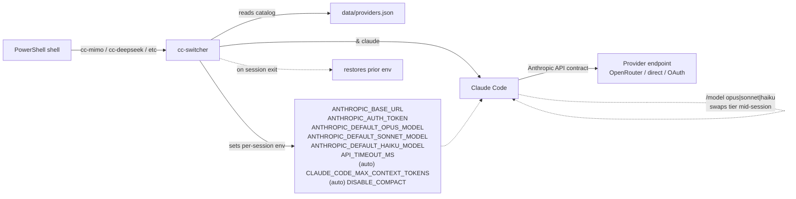

# cc-switcher

```text
   ┌──────────────────────────────────────────────────────────────┐
   │                                                              │
   │    ██████╗ ██████╗       ███████╗██╗    ██╗                  │
   │   ██╔════╝██╔════╝       ██╔════╝██║    ██║   PowerShell     │
   │   ██║     ██║     █████╗ ███████╗██║ █╗ ██║                  │
   │   ██║     ██║     ╚════╝ ╚════██║██║███╗██║   ↳ Claude Code  │
   │   ╚██████╗╚██████╗       ███████║╚███╔███╔╝     ↳ any LLM    │
   │    ╚═════╝ ╚═════╝       ╚══════╝ ╚══╝╚══╝                   │
   │                                                              │
   │    cc-switcher · v3.1.0                                      │
   │                                                              │
   └──────────────────────────────────────────────────────────────┘
```

> PowerShell module for launching Claude Code against any Anthropic-compatible LLM provider — DeepSeek, MiMo, GLM, Qwen, MiniMax, Kimi, NVIDIA NIM, Codex, and more.

`cc-switcher` flips the `ANTHROPIC_*` environment variables that Claude Code reads on startup, points them at an alternative provider's Anthropic-compatible endpoint, and launches `claude` for you. When the session exits it restores the previous environment, so your shell never gets stuck on a non-default provider.

It also tracks token usage per session, caches OpenRouter pricing, ships a doctor command for health checks, and provides tab completion for OpenRouter / OpenCode Go / NVIDIA NIM model IDs.

> First public release. Versions before 3.1.0 are summarized in `CHANGELOG.md`; this is the first cut with full git history.

---

## How it works



Each provider command sets all three Claude Code tiers (Opus / Sonnet / Haiku) at once. `/model` switches between them in-session. For 1M-class flagships (DeepSeek, MiMo v2.5-Pro, Qwen3.6-Plus, Xiaomi MiMo v2.5-Pro), `cc-switcher` auto-derives `CLAUDE_CODE_MAX_CONTEXT_TOKENS` so Claude Code's status bar shows the model's full context window instead of the 200K default.

---

## Quick start

Clone and import:

```powershell
git clone https://github.com/jimstratus/cc-switcher.git
Import-Module .\cc-switcher\cc-switcher.psd1
```

Or add to your `$PROFILE` so it loads in every shell:

```powershell
Import-Module C:\path\to\cc-switcher\cc-switcher.psd1
```

Reload (`. $PROFILE`) and type `cc-help` for the full command list.

---

## Usage

Each provider command sets all three Claude Code model tiers (Opus / Sonnet / Haiku) for that provider. Inside a session, use `/model opus|sonnet|haiku` to switch which tier the next turn uses.

```powershell
cc-mimo                        # MiMo V2.5-Pro / V2.5 / V2-Flash via OpenRouter
cc-deepseek                    # DeepSeek V4-Pro / V4-Pro / V4-Flash (direct, 1M context)
cc-glm                         # GLM-5.1 via OpenRouter
cc-openrouter <model-id>       # any OpenRouter model
cc-nvidia                      # NVIDIA NIM defaults (free tier)
cc-yolo                        # native Anthropic + --dangerously-skip-permissions
cc-reset                       # clear overrides, restore native Anthropic
```

Append `--yolo` to any `cc-*` command to launch with `--dangerously-skip-permissions`, or set `$env:CC_YOLO=1` to apply it to every launch in the current shell.

---

## Providers

| Command | Provider | Tiers (flagship / standard / fast) |
|---|---|---|
| `cc-deepseek` | DeepSeek V4 (direct) | v4-pro / v4-pro / v4-flash |
| `cc-glm` | GLM-5.1 (OpenRouter) | glm-5.1 / glm-5.1 / glm-4.5-air |
| `cc-kimi` | Kimi K2.6 (OpenRouter) | kimi-k2.6 (all three) |
| `cc-minimax` | MiniMax M2.7 (direct) | M2.7 / M2.7 / M2.7-highspeed |
| `cc-mimo` | MiMo V2.5 (Xiaomi via OpenRouter) | v2.5-pro / v2.5 / v2-flash |
| `cc-xiaomi` | Xiaomi MiMo (token-plan SGP, direct) | v2.5-pro / v2.5 / v2-pro |
| `cc-nvidia [model]` | NVIDIA NIM (free) | tier defaults, override with arg |
| `cc-qwen` | Qwen3 (Alibaba via OpenRouter) | qwen3.6-plus / qwen3-coder / qwen3-coder-next |
| `cc-codex` | OpenAI Codex (OAuth) | gpt-5.4 (run `cc-codex-login` first) |
| `cc-opencode <model>` | OpenCode Go generic | model passed via arg |
| `cc-opencode-minimax` | OpenCode Go MiniMax M2.7 (US) | minimax-m2.7 |
| `cc-openrouter <model>` | OpenRouter generic | model passed via arg |
| `cc-zai-glm51` | Z.AI GLM-5.1 [SLOW — China endpoint] | glm-5.1 / glm-5.1 / glm-4.5-air |

The provider catalog is JSON. Add or change providers by editing `data/providers.json` — no PowerShell function authoring required.

---

## Utility commands

| Command | Notes |
|---|---|
| `cc-help` | Full command catalog |
| `cc-launch` | Numbered interactive picker |
| `cc-pick` | Searchable grid picker (requires `Microsoft.PowerShell.ConsoleGuiTools`) |
| `cc-doctor` | Validate API keys + ping endpoints |
| `cc-pricing` | Live pricing from OpenRouter (5-min disk cache) |
| `cc-status` | Print current provider env vars |
| `cc-usage` | Token usage history (last 20 sessions) |
| `cc-reset` | Clear overrides → native Anthropic |
| `cc-yolo` | Native Anthropic + `--dangerously-skip-permissions` |
| `cc-codex-login` / `cc-codex-logout` | Codex OAuth device flow |

---

## Configuration

`cc-switcher` reads provider API keys from environment variables. Set whichever you actually use in your `$PROFILE` before importing the module:

```powershell
$env:OPENROUTER_API_KEY   = "sk-or-..."   # OpenRouter (covers cc-glm, cc-kimi, cc-mimo, cc-qwen, cc-openrouter)
$env:DEEPSEEK_API_KEY     = "sk-..."      # DeepSeek direct
$env:MINIMAX_API_KEY      = "..."         # MiniMax direct
$env:NVIDIA_API_KEY       = "nvapi-..."   # NVIDIA NIM
$env:OPENCODE_GO_API_KEY  = "..."         # OpenCode Go (cc-opencode, cc-opencode-minimax)
$env:XIAOMI_API_KEY       = "..."         # Xiaomi MiMo direct (token-plan SGP)
$env:ZAI_API_KEY          = "..."         # Z.AI direct (cc-zai-glm51)
$env:KIMI_API_KEY         = "..."         # Moonshot direct (optional)
```

Run `cc-doctor` to verify keys are present and reachable.

### Banner verbosity

`$env:CC_BANNER` controls module-load output. One of `full` (default), `compact`, or `minimal`. Set in `$PROFILE` before `Import-Module` to make it sticky across shells.

### Tab completion

`cc-openrouter`, `cc-opencode`, and `cc-nvidia` complete model arguments.
- `cc-openrouter` pulls from OpenRouter's live model list (cached 5 min on disk).
- `cc-opencode` and `cc-nvidia` use a curated list (edit `lib/completers.ps1`).

### Token usage tracking

After every session, the module recursively scans `~/.claude/projects/**/*.jsonl` for Claude Code's session transcripts and aggregates token counts to `data/.usage-log.jsonl`. Run `cc-usage` for the report.

---

## Documentation

- **[`AGENTS.md`](AGENTS.md)** — first-stop orientation for AI coding agents working in this repo. Cross-tool, lists invariants and verification steps.
- **[`docs/architecture.md`](docs/architecture.md)** — internals: module load, launch lifecycle, env-var contract, snapshot/restore, auto-context derivation.
- **[`docs/catalog-schema.md`](docs/catalog-schema.md)** — full field reference for `data/providers.json`.
- **[`docs/adding-a-provider.md`](docs/adding-a-provider.md)** — step-by-step contributor walkthrough for adding a new provider.

---

## Repository layout

```
cc-switcher/
├── cc-switcher.psd1            # module manifest
├── cc-switcher.psm1            # entry point
├── lib/
│   ├── core.ps1                # Invoke-CCLaunch, Reset-CC, Get-CC-Status
│   ├── providers.ps1           # catalog loader + dispatcher
│   ├── codex.ps1               # OAuth flow
│   ├── pricing.ps1             # OpenRouter live pricing
│   ├── doctor.ps1              # cc-doctor health check
│   ├── completers.ps1          # tab completion
│   ├── usage.ps1               # token tracker
│   ├── picker.ps1              # cc-launch + cc-pick
│   └── update-check.ps1        # mtime delta on load
├── data/
│   └── providers.json          # the catalog (edit me)
├── README.md
├── CHANGELOG.md
├── ISSUES.md                   # known issues / workarounds
├── CONTRIBUTING.md
└── LICENSE
```

Runtime caches (`data/.pricing-cache.json`, `data/.usage-log.jsonl`, `data/.last-load`) are gitignored — they're regenerated as you use the module.

---

## Requirements

- PowerShell 7.0+
- [Claude Code](https://docs.anthropic.com/claude/docs/claude-code) installed and on `PATH` as `claude`
- Optional: `Microsoft.PowerShell.ConsoleGuiTools` for `cc-pick`

  ```powershell
  Install-Module Microsoft.PowerShell.ConsoleGuiTools -Scope CurrentUser
  ```

---

## Versioning

`cc-switcher` follows [Semantic Versioning](https://semver.org/):

- **MAJOR** — breaking changes to public commands or env-var contract.
- **MINOR** — new providers, new commands, new catalog fields.
- **PATCH** — bug fixes, catalog tweaks (model IDs, context corrections), doc updates.

The module manifest (`cc-switcher.psd1`), the in-script version constant (`cc-switcher.psm1`), and the catalog `version` field in `data/providers.json` are bumped together when any of them changes meaningfully.

See [CHANGELOG.md](CHANGELOG.md) for the full release history and [GitHub releases](https://github.com/jimstratus/cc-switcher/releases) for downloadable tags.

## Contributing

See [CONTRIBUTING.md](CONTRIBUTING.md). The short version: open an issue, run `cc-doctor` before reporting a problem, and add new providers by editing `data/providers.json` rather than writing PowerShell.

## Troubleshooting

See [ISSUES.md](ISSUES.md) for known issues and workarounds.

## License

MIT — see [LICENSE](LICENSE).
