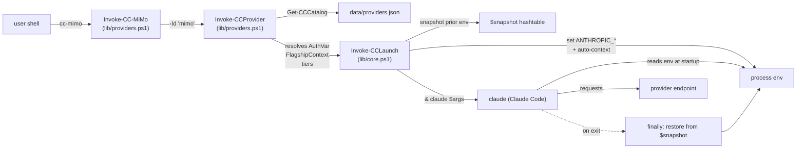
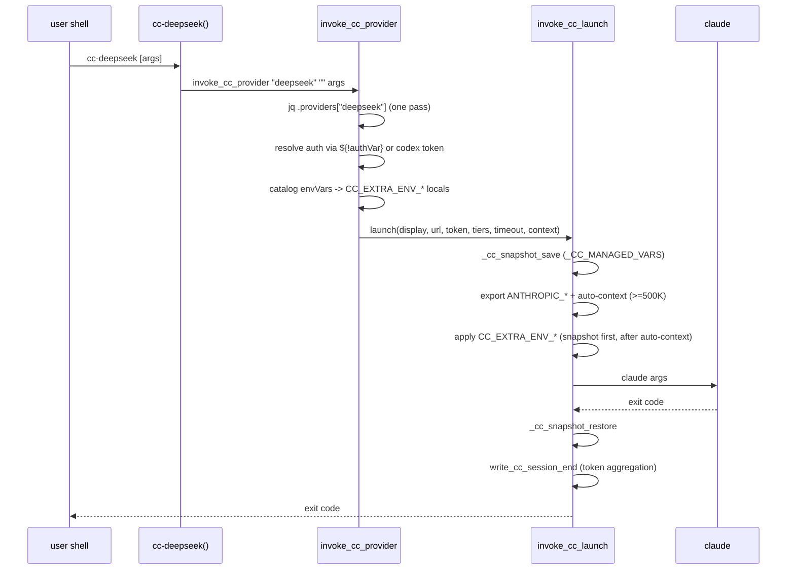

# Architecture

Internal reference for `cc-switcher`. Read this before changing `lib/core.ps1`, `lib/providers.ps1`, the bash counterparts in `bash/lib/`, or the env-var contract.

Sections below describe the PowerShell implementation, which is the reference; the bash port mirrors it function-for-function. Bash-specific deltas are collected in [The bash port](#the-bash-port) at the end.

## Overview



A `cc-*` invocation is a four-stage pipeline: wrapper → dispatcher → catalog lookup → launcher. The launcher snapshots the env, mutates it, runs `claude`, and restores in a `finally` block. The provider catalog is the source of truth; everything in `lib/` is generic.

## Module load

`Import-Module cc-switcher.psd1` loads `cc-switcher.psm1`, which:

1. Sets `$script:CCSwitcherRoot = $PSScriptRoot` and `$script:CCSwitcherVersion = '3.3.1'` (cc-switcher.psm1:7-8).
2. Dot-sources every file in `lib/` in dependency order: `core` → `providers` → `codex` → `pricing` → `doctor` → `completers` → `usage` → `picker` → `update-check` (cc-switcher.psm1:11-19). Total parse time is well under 50ms.
3. Calls `Register-CCCompleters` (cc-switcher.psm1:22, defined in `lib/completers.ps1`) to wire up tab completion for `cc-openrouter`, `cc-opencode`, and `cc-nvidia`.
4. Registers public aliases via `Set-Alias` (cc-switcher.psm1:25-50).
5. Calls `Test-CCUpdated` (defined in `lib/update-check.ps1`) which compares `cc-switcher.psm1`'s mtime against the value cached in `data/.last-load` and rewrites the cache. The result drives the `[updated since last shell]` flag in the banner.
6. Runs the load banner: `full` (default — calls `Show-CCHelp`), `compact` (one line + provider names), or `minimal` (one line). Override with `$env:CC_BANNER` (cc-switcher.psm1:103-133).
7. `Export-ModuleMember -Function * -Alias *` exports everything; the manifest's `FunctionsToExport`/`AliasesToExport` is the actual filter.

`Get-CCCatalog` lazily reads and memoizes `data/providers.json` on first call (`lib/providers.ps1:8-15`). Subsequent calls return the cached object.

## The launch lifecycle

A typical invocation, end to end (using `cc-mimo` as the example):

1. **Alias resolves.** `cc-mimo` → `Invoke-CC-MiMo` (cc-switcher.psm1:29).
2. **Wrapper dispatches.** `Invoke-CC-MiMo` is a one-liner that calls `Invoke-CCProvider -Id 'mimo' -ClaudeArgs $ClaudeArgs` (`lib/providers.ps1:109`).
3. **Dispatcher loads catalog.** `Invoke-CCProvider` calls `Get-CCProviders` (`lib/providers.ps1:46`), which parses `data/providers.json` once and projects each provider into a flat object (`lib/providers.ps1:17-43`).
4. **Auth resolves.** If `requiresOAuth: true` (only Codex), `Get-CC-CodexToken` reads the cached OAuth token (`lib/providers.ps1:57-63`, `lib/codex.ps1:8-17`). Otherwise the dispatcher reads `[Environment]::GetEnvironmentVariable($p.AuthVar)` (`lib/providers.ps1:65`).
5. **Tier names translate.** Catalog `tiers.flagship/standard/fast` → wrapper params `OpusModel/SonnetModel/HaikuModel` (`lib/providers.ps1:72-74`). The translation is the public contract — catalog uses semantic names, Claude Code uses Anthropic's product names.
6. **Flagship context resolves.** `contextByTier.flagship` if present, else uniform `context` field, else `0` (`lib/providers.ps1:85-90`).
7. **`Invoke-CCLaunch` runs** (`lib/core.ps1:6-137`). See "The env-var contract" below.
8. **`& claude` runs** with any `$ClaudeArgs` passed through (`lib/core.ps1:121-125`).
9. **Session ends → env restores.** The `finally` block at `lib/core.ps1:132-136` walks `$snapshot.Keys` and writes each value back via `[Environment]::SetEnvironmentVariable($k, $snapshot[$k], 'Process')`. `$null` values clear the var.

## The env-var contract

`Invoke-CCLaunch` (`lib/core.ps1:6-137`) sets the following process-scope env vars. Every var set MUST also be snapshotted at function entry (`lib/core.ps1:34-48`) and cleared by `Reset-CC` (`lib/core.ps1:151-160`).

| Variable | Set when | Source | Cleanup |
|---|---|---|---|
| `ANTHROPIC_BASE_URL` | always | catalog `baseUrl` | snapshot/restore |
| `ANTHROPIC_AUTH_TOKEN` | always | env var named in `authVar` (or OAuth token for Codex) | snapshot/restore |
| `ANTHROPIC_MODEL` | always | catalog `tiers.flagship` (= `$OpusModel` param) | snapshot/restore |
| `ANTHROPIC_DEFAULT_OPUS_MODEL` | always | `tiers.flagship` | snapshot/restore |
| `ANTHROPIC_DEFAULT_SONNET_MODEL` | always | `tiers.standard` | snapshot/restore |
| `ANTHROPIC_DEFAULT_HAIKU_MODEL` | always | `tiers.fast` | snapshot/restore |
| `ANTHROPIC_SMALL_FAST_MODEL` | always | `tiers.fast` (same as Haiku) | snapshot/restore |
| `API_TIMEOUT_MS` | always | catalog `timeoutMs` (default 3000000) | snapshot/restore |
| `CLAUDE_CODE_DISABLE_NONESSENTIAL_TRAFFIC` | when `disableNonEssential: true` | hardcoded `"1"` | snapshot/restore |
| `CLAUDE_CODE_MAX_CONTEXT_TOKENS` | when flagship context >= 500K | derived from `contextByTier.flagship` or `context` | snapshot/restore |
| `DISABLE_COMPACT` | same trigger as MAX_CONTEXT_TOKENS | hardcoded `"1"` | snapshot/restore |
| `CLAUDE_CODE_MAX_OUTPUT_TOKENS` | not set by core (catalog can set via `envVars`) | catalog `envVars` | snapshot/restore |
| (catalog `envVars` keys) | when set in catalog | catalog `envVars` map | snapshot at runtime if not already keyed |

The "snapshot at runtime if not already keyed" line refers to the loop at `lib/core.ps1:49-55`: `ExtraEnv` keys not already in `$snapshot` get a snapshot of their prior value before the new value is written, so they're correctly restored even when they're catalog-specific.

## Snapshot / restore lifecycle

The snapshot hashtable at `lib/core.ps1:35-48` is initialized with the *current* value of every env var the function will touch. The `try` block sets new values; the `finally` block writes the snapshotted values back. A `$null` value in the snapshot becomes a cleared env var (`[Environment]::SetEnvironmentVariable($k, $null, 'Process')`).

**Why every set var must be in the snapshot.** If `Invoke-CCLaunch` sets a var that isn't snapshotted, the prior value (if any) is lost permanently, AND the new value leaks into the parent shell after `claude` exits. The next `cc-*` invocation inherits the leak.

**The v3.1.0 fix.** Auto-context (added in 3.1.0) sets `CLAUDE_CODE_MAX_CONTEXT_TOKENS` and `DISABLE_COMPACT` automatically. Before the fix, those two vars were not in the snapshot dict, so:
- They leaked into the parent shell after a 1M-class provider exited.
- Switching from `cc-deepseek` to a 256K provider like `cc-kimi` left the parent shell with the wrong context cap.

The fix added them to `$snapshot` (`lib/core.ps1:46-47`) and to `Reset-CC`'s clear list (`lib/core.ps1:156-157`). Both must always be in sync. Adding a new always-set env var means three edits: the `$env:FOO = ...` write, the snapshot dict, and `Reset-CC`'s var list.

## Auto-context derivation

`Invoke-CCLaunch` auto-sets `CLAUDE_CODE_MAX_CONTEXT_TOKENS` + `DISABLE_COMPACT=1` when `$FlagshipContext -ge 500000` (`lib/core.ps1:75-84`).

**Source.** `Invoke-CCProvider` resolves the value (`lib/providers.ps1:85-90`):
- `contextByTier.flagship` if present (per-tier catalog)
- else `context` (uniform catalog)
- else `0` (skips auto-context)

**Threshold.** `>= 500000` is deliberate. It cleanly separates 1M-class providers (DeepSeek 1M, MiMo v2.5-Pro 1M, Qwen3.7 Max 1M, Xiaomi v2.5-Pro 1M, Grok 2M) from 256K models (Kimi K2.7 Code, MiMo v2-Flash) and ~200K models (Codex 200K, OpenCode Go MiniMax ~205K) where the trade — losing Claude Code's auto-compaction safety net — is not worth a small bump above the 200K default. Above 500K, the gain is large (5x or more); below it, the gain is marginal.

**What it sets.** Two vars, both required (per Claude Code's docs — `MAX_CONTEXT_TOKENS` is ignored unless `DISABLE_COMPACT=1` is also set):
```
CLAUDE_CODE_MAX_CONTEXT_TOKENS = "$FlagshipContext"
DISABLE_COMPACT                = "1"
```

**Tradeoff: per-tier accuracy is partial.** When a provider has different tier sizes (e.g., MiMo: flagship 1M, fast 256K), the env var stays at the flagship size for the whole session. `/model haiku` will display the larger value in the status bar, but the API will reject prompts past the smaller model's true ceiling. This is acceptable for opus-primary workflows where the user mostly stays on flagship and occasionally drops to fast. Documented in the catalog `_doc._auto_context` block.

**How to opt in a sub-500K provider.** Set `envVars` explicitly in the catalog block. `ExtraEnv` is applied AFTER the auto-block (`lib/core.ps1:86-90`), so it can override the auto-derived values too — but the more common case is opting in:

```json
"envVars": {
  "CLAUDE_CODE_MAX_CONTEXT_TOKENS": "256000",
  "DISABLE_COMPACT": "1"
}
```

## Tier mapping

The catalog uses semantic names: `flagship`, `standard`, `fast`. Claude Code's wire protocol uses Anthropic's product names: `opus`, `sonnet`, `haiku`. The translation lives in `Invoke-CCProvider` (`lib/providers.ps1:72-74`):

| Catalog tier | Wrapper param | Env var | `/model` slot |
|---|---|---|---|
| `tiers.flagship` | `-OpusModel` | `ANTHROPIC_DEFAULT_OPUS_MODEL` + `ANTHROPIC_MODEL` | `/model opus` |
| `tiers.standard` | `-SonnetModel` | `ANTHROPIC_DEFAULT_SONNET_MODEL` | `/model sonnet` |
| `tiers.fast` | `-HaikuModel` | `ANTHROPIC_DEFAULT_HAIKU_MODEL` + `ANTHROPIC_SMALL_FAST_MODEL` | `/model haiku` |

**Why the rename (in v3.0.3).** Some providers (Qwen, MiMo, MiniMax) have nothing called "opus" or "sonnet" — those are Claude-Code-internal slots. The catalog was previously mixing protocol names with model concepts. New names describe the role within the provider's lineup ("which is the flagship?") rather than borrowing Anthropic's product names. The translation in the dispatcher means `/model opus|sonnet|haiku` inside a session still works exactly the same.

## The OpenRouter generic dispatcher

`Invoke-CC-OpenRouter` (`lib/providers.ps1:126-136`) is special. It does NOT use the catalog and does NOT trigger auto-context. It's a thin wrapper for one-off OpenRouter model launches:

- Takes a `-Model` arg (defaults to `moonshotai/kimi-k2.6`).
- Sets the same model on all three tiers.
- `FlagshipContext` defaults to 0, so auto-context never triggers.
- Reads `OPENROUTER_API_KEY` directly from env.

Use it for ad-hoc experimentation. If a particular OpenRouter model becomes a regular workflow, promote it to a catalog entry so it picks up auto-context, tier mapping, and `cc-doctor` coverage.

`Invoke-CC-OpenCode` (`lib/providers.ps1:139-150`) is the OpenCode Go equivalent — same pattern, default `minimax-m2.7`, hardcoded base URL `https://opencode.ai/zen/go`, sets `disableNonEssential`.

## Codex OAuth

`cc-codex-login` runs an OAuth device flow (`lib/codex.ps1:19-59`):

1. POSTs to `oauth.openai.com/v1/device_authorization` for a `device_code` + `user_code` + `verification_uri`.
2. Opens the verification URL in the browser, prints the user code.
3. Polls `oauth.openai.com/v1/token` every 5s for up to 120s.
4. On success, writes the token JSON to `~/.config/codex-oauth/token.json`.

`Get-CC-CodexToken` (`lib/codex.ps1:8-17`) reads the cached token, returns `$null` if the file is missing or `expires_at` is in the past.

`Invoke-CCProvider` checks `requiresOAuth: true` in the catalog (`lib/providers.ps1:57-63`) and routes auth through `Get-CC-CodexToken` instead of reading an env var.

`cc-codex-logout` deletes the cache file.

## Token usage tracking

`lib/usage.ps1` aggregates token counts from Claude Code's session JSONL files after each launch.

- **`Write-CCSessionStart`** (called from `Invoke-CCLaunch:117-119`): records start timestamp and snapshots the LastWriteTime of every existing JSONL under `~/.claude/projects/`.
- **`Write-CCSessionEnd`** (called from `Invoke-CCLaunch:128-130`): finds JSONL files modified during the session, parses each line as JSON, sums `message.usage.{input_tokens, output_tokens, cache_read_input_tokens, cache_creation_input_tokens}`, appends an entry to `data/.usage-log.jsonl`.
- **`Get-CCUsage`** (alias `cc-usage`): tails the last N entries (default 20), prints them with totals and per-provider breakdown.

The log file is gitignored. Both write functions are wrapped in `Get-Command ... -ErrorAction SilentlyContinue` checks at the call sites in `core.ps1` so usage tracking failing softly never breaks a launch.

## Pricing cache

`lib/pricing.ps1` exposes `Get-CCLivePricing` (memoized via `$script:ORPricingCache`) and `Get-CCPricing` (the `cc-pricing` command).

- TTL: 300 seconds (`$script:ORPricingTTL_sec`, `lib/pricing.ps1:6`).
- Memory cache first, then disk cache at `data/.pricing-cache.json`, then live fetch from `https://openrouter.ai/api/v1/models` if both are stale.
- Disk cache is a `{ fetchedAt, data }` envelope so multiple shells share the cache.
- Returns `$null` if `OPENROUTER_API_KEY` is unset and no cache is available.

The completer for `cc-openrouter` (`lib/completers.ps1:8-19`) reads the same cached model list to drive tab completion of OpenRouter model ids.

## The bash port

`bash/` is a function-for-function port for Linux/macOS shells. It is **sourced** (from `~/.bashrc` or via `make install`), not executed — which imposes the port's one hard constraint: **nothing at source time may change shell state**. No `set -e`/`-u`/`pipefail`, no `shopt`, no traps. Anything set when the file is sourced leaks into the user's interactive session permanently. CI asserts `$-` is unchanged after sourcing.

### File / function mapping

| PowerShell | bash | Notes |
|---|---|---|
| `cc-switcher.psm1` | `bash/cc-switcher.sh` | sources `lib/`, defines `cc-*` functions (no alias layer), banner |
| `lib/core.ps1` `Invoke-CCLaunch` | `bash/lib/core.sh` `invoke_cc_launch` | same env contract; snapshot in the `_CC_SNAPSHOT` assoc array |
| `lib/core.ps1` `Reset-CC` / `Get-CC-Status` | `reset_cc` / `get_cc_status` | both driven by the shared `_CC_MANAGED_VARS` array |
| `lib/providers.ps1` `Invoke-CCProvider` | `bash/lib/providers.sh` `invoke_cc_provider` | one `jq` pass fetches all provider fields |
| `lib/providers.ps1` `Get-CCProviders` | `list_cc_providers` | one `jq` pass emits pipe-delimited rows |
| `lib/picker.ps1` `cc-launch` / `cc-pick` | `invoke_cc_launch_menu` | numbered menu only; no gridview equivalent |
| `lib/codex.ps1` | `bash/lib/codex.sh` | token cache written `0600` under `umask 077` |
| `lib/usage.ps1` | `bash/lib/usage.sh` | adds a SQLite `sessions` table next to the JSONL log |
| `lib/pricing.ps1` | `bash/lib/pricing.sh` | same `{fetchedAt, data}` disk-cache envelope |
| `lib/doctor.ps1` | `bash/lib/doctor.sh` | key list shared with `cc-status` via `_CC_API_KEY_VARS` |
| `lib/completers.ps1` | `bash/lib/completers.sh` | `complete -F`, registered at source time |
| `lib/update-check.ps1` | `bash/lib/update-check.sh` | also hosts `show_cc_help` |

### Launch lifecycle (bash)



### Deltas worth knowing

- **Env restore is best-effort, not `finally`-guaranteed.** PowerShell restores in a `try/finally`. Bash has no equivalent for a sourced function without installing traps (which would leak — see the constraint above), so restore runs on the normal path after `claude` returns. A `Ctrl+C` that kills the *function* (not just `claude`) can skip restore; `cc-reset` recovers.
- **Catalog `envVars` travel as `CC_EXTRA_ENV_*` function-locals.** `invoke_cc_provider` declares them `local` (validated identifiers only); `invoke_cc_launch` discovers them via `compgen -v CC_EXTRA_ENV_` through bash's dynamic scoping, snapshots each target var, and applies them **after** the auto-context block — same ordering contract as PowerShell's `ExtraEnv`. Because they're locals, they vanish with the function frame even on interrupt. Users can also export `CC_EXTRA_ENV_<NAME>` manually for ad-hoc extra env.
- **The catalog is duplicated.** The bash port reads `bash/data/providers.json` (`CC_CATALOG_PATH`), a copy of the root catalog. CI's "catalogs in sync" job fails the build when the two diverge; edit both in one commit.
- **Usage tracking adds SQLite.** `write_cc_session_end` aggregates each modified transcript with a single `jq -s` pass per file and writes both the JSONL log and a `sessions` row in `bash/data/.usage.db` (when `sqlite3` is available). Both writes are `|| true`-guarded so usage tracking can never break a launch.
- **`jq` is the parsing workhorse.** Catalog reads are single-pass per call site. Keep it that way: a per-line `echo | jq` loop over a multi-thousand-line transcript means thousands of process forks at session exit.
