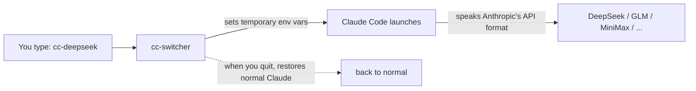
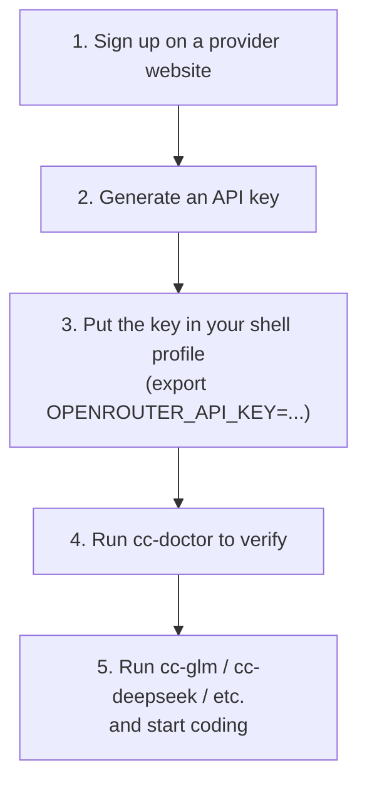
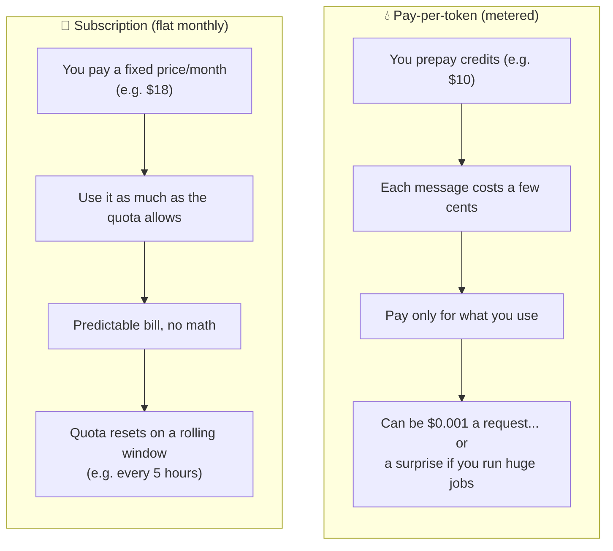
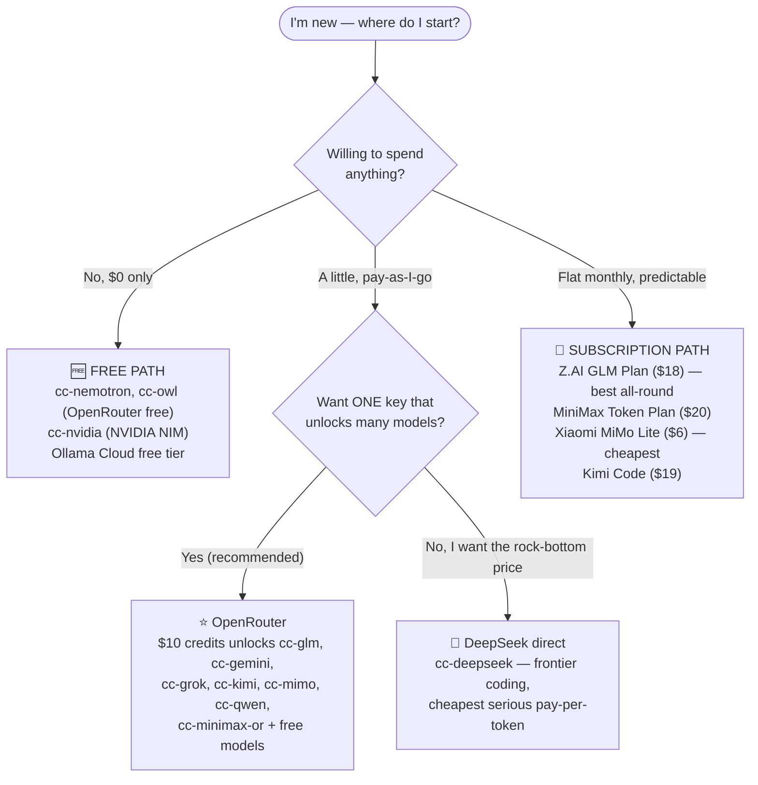
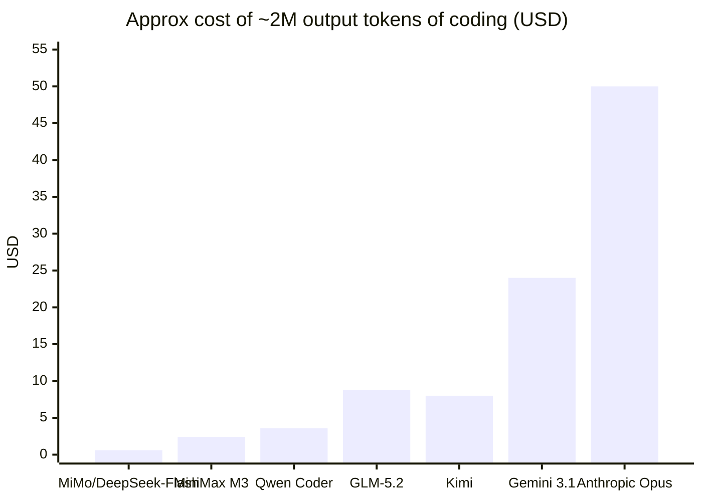
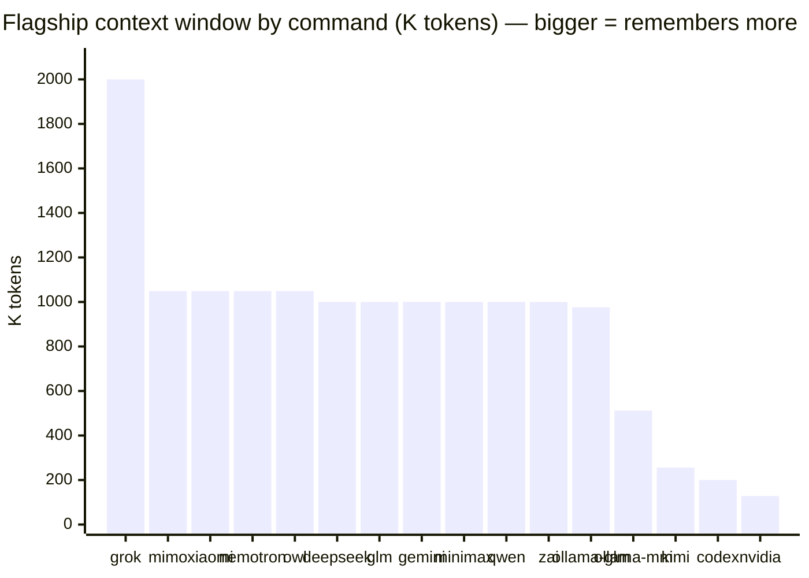
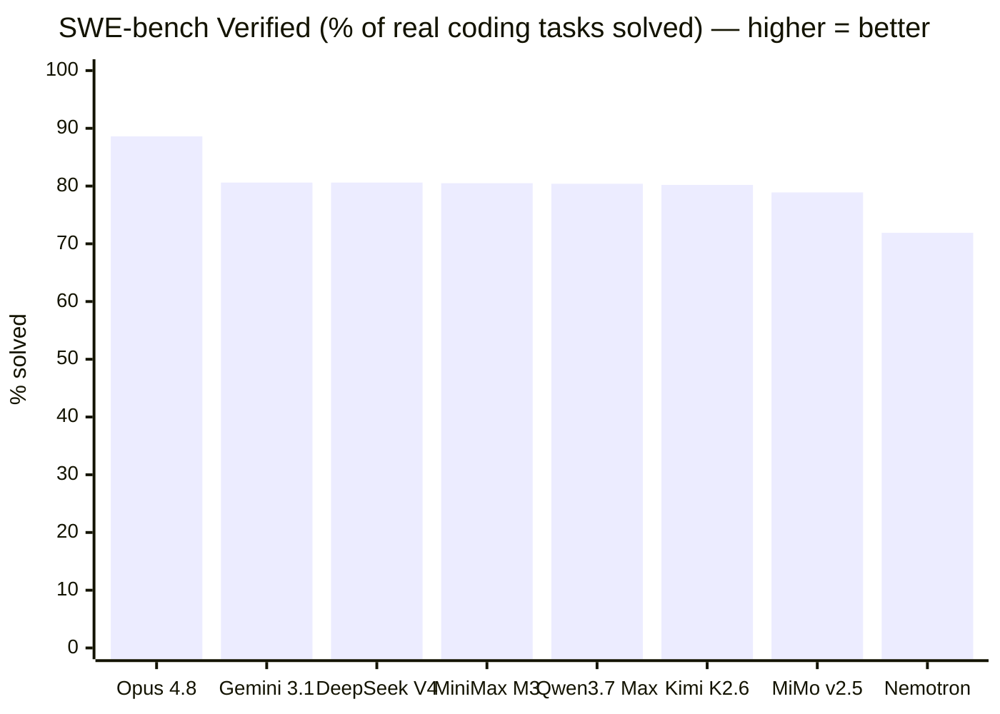

# cc-switcher · Getting Started Guide (for total beginners)

> **New to Claude Code and AI coding tools?** Start here. This guide takes you from
> *"I have nothing set up"* to *"I'm running Claude Code against a model that costs a
> fraction of Anthropic's price — or nothing at all."*
>
> **There is also a visual, interactive version of this guide:** open
> [`onboarding.html`](onboarding.html) in any web browser for rendered charts,
> color-coded pricing tables, and the same content with diagrams.

---

## Table of contents

1. [What is this and why would I use it?](#1-what-is-this-and-why-would-i-use-it)
2. [The mental model (read this first)](#2-the-mental-model-read-this-first)
3. [Step 0 — Install Claude Code + cc-switcher](#3-step-0--install-claude-code--cc-switcher)
4. [The two ways you pay: per-token vs. subscription](#4-the-two-ways-you-pay-per-token-vs-subscription)
5. [Pick your path (decision flowchart)](#5-pick-your-path-decision-flowchart)
6. [⭐ The fastest start: OpenRouter (one key, nine providers)](#6--the-fastest-start-openrouter-one-key-nine-providers)
7. [Provider sign-up walkthroughs](#7-provider-sign-up-walkthroughs)
8. [Pricing cheat-sheet (all providers)](#8-pricing-cheat-sheet-all-providers)
9. [Context windows — the 1M+ club](#9-context-windows--the-1m-club)
10. [How good are these models? (benchmarks)](#10-how-good-are-these-models-benchmarks)
11. [Recommended starting recipes](#11-recommended-starting-recipes)
12. [Tips for someone brand-new to AI coding](#12-tips-for-someone-brand-new-to-ai-coding)
13. [Glossary](#13-glossary)

> 💱 **Prices in this guide were gathered on 2026-06-22 and *will* drift.** Treat
> them as "roughly this ballpark." Always confirm on the provider's own pricing
> page (linked throughout), and run `cc-pricing` for live OpenRouter rates.

---

## 1. What is this and why would I use it?

**Claude Code** is Anthropic's AI coding assistant that runs in your terminal. By
default it talks to Anthropic's own models (Claude Opus / Sonnet / Haiku), which are
excellent — but you need an Anthropic subscription or pay Anthropic's API prices.

**cc-switcher** is a small script that lets Claude Code talk to *other* AI providers
instead — DeepSeek, GLM, MiniMax, Kimi, Qwen, Gemini, Grok, and more. Many of these
are **5×–100× cheaper** than Anthropic, several have **much bigger memory** (context
windows up to 2 million tokens vs. Anthropic's 200K), and **some are completely free.**

You keep the exact same Claude Code experience — same commands, same interface — you
just change *which company's brain* is answering.



---

## 2. The mental model (read this first)

There are only **three things** you ever need to give a provider's robot:

| Thing | What it is | Where cc-switcher puts it |
|---|---|---|
| **A web address (endpoint)** | Where the AI lives, e.g. `https://api.deepseek.com/anthropic` | `ANTHROPIC_BASE_URL` |
| **An API key** | Your secret password, e.g. `sk-or-v1-abc123...` | `ANTHROPIC_AUTH_TOKEN` |
| **A model name** | Which brain, e.g. `deepseek-v4-pro` | `ANTHROPIC_DEFAULT_*_MODEL` |

cc-switcher already knows the address and model name for every provider (they live in
`data/providers.json`). **Your only job is to get an API key** for the providers you
want and put it in an environment variable. That's the whole setup.



> 🔑 **A note on Anthropic-compatible vs. OpenAI-compatible.** Claude Code speaks
> "Anthropic's API language." Most providers in this catalog offer an
> Anthropic-compatible endpoint, so they slot right in. A couple (NVIDIA NIM, OpenAI
> Codex) speak a different dialect — cc-switcher handles those specially, you don't
> have to think about it.

---

## 3. Step 0 — Install Claude Code + cc-switcher

You need these regardless of which provider you choose.

### Install Claude Code

```bash
# macOS / Linux / WSL — native installer
curl -fsSL https://claude.ai/install.sh | bash

# or via npm (needs Node 18+)
npm install -g @anthropic-ai/claude-code
```

Verify it's on your PATH: `claude --version`.
Docs: <https://code.claude.com/docs/en/setup>

> You do **not** need a paid Anthropic plan to use cc-switcher with other providers —
> Claude Code only needs to be *installed*. (You'd only need an Anthropic plan if you
> also want to use Anthropic's own models via `cc-reset` / `cc-yolo`.)

### Install cc-switcher

```bash
git clone https://github.com/jimstratus/cc-switcher.git

# bash / zsh (Linux, macOS)
source ./cc-switcher/bash/cc-switcher.sh

# PowerShell (Windows, macOS)
Import-Module ./cc-switcher/cc-switcher.psd1
```

To make it load in every new shell, add that `source`/`Import-Module` line to your
`~/.bashrc` / `~/.zshrc` / `$PROFILE`.

Then run **`cc-help`** to see every command, and **`cc-doctor`** to check which keys
you have set.

> 🗂️ **Tip:** copy [`.env.example`](https://github.com/jimstratus/cc-switcher/blob/main/.env.example) to `~/.cc-switcher.env`, fill in
> the keys you have, and add `[ -f ~/.cc-switcher.env ] && source ~/.cc-switcher.env`
> to your `~/.bashrc`. Before you paste any real key, read the 5-minute
> **[API key safety guide](api-key-safety.md)** — it covers keeping keys out of git
> and capping your spend so you can't get a surprise bill.

---

## 4. The two ways you pay: per-token vs. subscription

This is the single most important concept for a beginner. Every provider uses one (or
both) of these billing models:



| | **Pay-per-token** | **Subscription ("coding plan")** |
|---|---|---|
| Examples | OpenRouter, DeepSeek, MiniMax/Kimi/Xiaomi PAYG | Z.AI GLM Plan, MiniMax Token Plan, Kimi Code, Ollama Cloud, OpenCode Go, ChatGPT/Codex |
| Best when | You're experimenting / light or spiky use | You code daily and want a predictable bill |
| Risk | A runaway job can cost more than expected | Hitting the quota means waiting for reset |
| Beginner advice | **Start here** — top up $10, see what things actually cost | Switch once you know your daily usage |

> 🧠 **The "token" unit:** prices are quoted **per 1 million tokens**. A token is ~0.75
> of a word. A typical coding question + answer might be a few thousand tokens.
> "Output" tokens (what the AI writes) usually cost 2–5× more than "input" tokens
> (what you send), and **coding agents generate a LOT of output**, so the *output*
> price is the number that matters most.

---

## 5. Pick your path (decision flowchart)



**Short version:**
- **Just exploring, $0:** `cc-nemotron` or `cc-owl` (free via OpenRouter), or `cc-nvidia`.
- **Best first purchase:** **OpenRouter**, $10 of credits. One key, nine provider `cc-*` commands (two of them free) plus the generic `cc-openrouter`. *(See §6.)*
- **Want the absolute cheapest quality coding:** **DeepSeek** direct.
- **Code every day, hate surprise bills:** **Z.AI GLM Coding Plan** ($18/mo) — easiest signup, best value.

---

## 6. ⭐ The fastest start: OpenRouter (one key, nine providers)

OpenRouter is a "universal adapter" — one account and one API key gives you access to
hundreds of models from dozens of companies. **In cc-switcher, a single
`OPENROUTER_API_KEY` unlocks nine provider commands:**

`cc-glm` · `cc-gemini` · `cc-grok` · `cc-kimi` · `cc-mimo` · `cc-minimax-or` · `cc-qwen` · `cc-nemotron` (free) · `cc-owl` (free) · plus the generic `cc-openrouter <model>`

This is why it's the recommended starting point — you sign up **once** and can try
almost the whole catalog.

### Sign up & get your key (5 minutes)

1. Go to **<https://openrouter.ai/sign-up>** and register (Google / GitHub / email).
2. Add credits at **<https://openrouter.ai/settings/credits>** — pay by card or crypto.
   - 💡 **Buy at least $10.** It's the threshold that bumps your *free-model* limit
     from 50 → **1,000 requests/day**, and that $10 never expires.
   - Card purchases add a ~5.5% fee (min $0.80), so $10 costs ~$10.55.
3. Create a key at **<https://openrouter.ai/settings/keys>** → *Create API Key*.
   It looks like `sk-or-v1-...`. **Copy it now — it's shown only once.**
4. Put it in your shell profile:

   ```bash
   # bash / zsh
   export OPENROUTER_API_KEY="sk-or-v1-..."
   ```
   ```powershell
   # PowerShell
   $env:OPENROUTER_API_KEY = "sk-or-v1-..."
   ```

5. Reload your shell, run `cc-doctor` to confirm, then:

   ```bash
   cc-glm           # GLM-5.2 — great all-round coder, 1M context
   cc-nemotron      # FREE — try it with zero risk
   cc-qwen          # Qwen3.7 Max — cheap & strong, 1M context
   ```

> OpenRouter is **pay-per-token only — no monthly plan.** You're spending your prepaid
> credits. The free `:free` models (`cc-nemotron`, `cc-owl`) cost nothing but are
> rate-limited (20 requests/min; 1,000/day once you've added $10).

---

## 7. Provider sign-up walkthroughs

Each provider below shows: the command(s) it powers, the env var you set, where to sign
up, and how to get the key. **You only need to set up the ones you actually want.**

### 💸 DeepSeek — cheapest serious pay-per-token coding · `cc-deepseek`
- **Env var:** `DEEPSEEK_API_KEY` (looks like `sk-...`)
- **Sign up:** <https://platform.deepseek.com/sign_up> (email/phone; no card to register)
- **Get key:** Console → *API Keys* → *Create new secret key* (shown once)
- **Why:** V4-Flash is ~$0.14/$0.28 per 1M (frontier-class coding at the price floor);
  V4-Pro is stronger. **Automatic off-peak discounts** (~50–75% off, ~16:30–00:30 UTC)
  and near-free cache hits. Native Anthropic endpoint — slots straight into Claude Code.
- **Docs:** <https://api-docs.deepseek.com>

### 📅 Z.AI / GLM — best all-round subscription · `cc-glm` (OpenRouter) or `cc-zai-glm51` (direct)
- **Env var:** `ZAI_API_KEY` for the direct command; or just use `cc-glm` via OpenRouter.
- **Sign up:** <https://z.ai> (email or Google — no Chinese phone needed)
- **Get key:** <https://z.ai/manage-apikey/apikey-list>
- **Coding Plan (subscription):** <https://z.ai/subscribe> — **Lite ~$18/mo**, Pro ~$72,
  Max ~$160 (cheaper with quarterly/yearly). Quotas are measured in *prompts*, and all
  tiers include GLM-5.2. This is the **most popular coding subscription** for a reason:
  easiest signup, best model-per-dollar, Opus-comparable quality.
- **Note:** For most people `cc-glm` (GLM-5.2 via your OpenRouter key) is the simplest
  way to try GLM. Use the direct GLM Coding Plan once you've decided you love it.
- **Docs:** <https://docs.z.ai/devpack/tool/claude>

### 📅/💧 MiniMax — flat plan *or* cheap PAYG · `cc-minimax` (direct), `cc-minimax-or` (OpenRouter)
- **Env var:** `MINIMAX_API_KEY` (PAYG key `sk-...`, or token-plan key `sk-cp...`)
- **Sign up (international):** <https://platform.minimax.io>
- **Get key:** Account → *API Keys* (PAYG) or Billing → *Token Plan* (subscription)
- **Pricing:** PAYG M3 ~$0.30/$1.20 per 1M. **Token Plan:** Plus **$20/mo**, Max $50,
  Ultra $120 — flat monthly, great for daily Claude Code use. 1M context.
- **Docs:** <https://platform.minimax.io/docs/token-plan/claude-code>

### 📅/💧 Moonshot / Kimi — strong agentic coder · `cc-kimi` (via OpenRouter)
- **Env var:** uses your `OPENROUTER_API_KEY` (or `KIMI_API_KEY` for the direct API)
- **Sign up:** <https://platform.moonshot.ai> (international; `sk-...` key)
- **Pricing:** PAYG K2.7-Code ~$0.19 (cache hit) / $0.95 (miss) / $4.00 output per 1M.
  **Kimi Code subscription:** Moderato **$19/mo** → Vivace $199.
- **Note:** context is 256K (smaller than the 1M crowd) but a genuinely capable coder.
- **Docs:** <https://platform.moonshot.ai>

### 💸 Xiaomi MiMo — cheapest subscription of all · `cc-mimo` (OpenRouter), `cc-xiaomi` (direct)
- **Env var:** `XIAOMI_API_KEY` for `cc-xiaomi`; or use `cc-mimo` via OpenRouter.
- **Sign up:** <https://platform.xiaomimimo.com> (needs a Xiaomi account from id.mi.com)
- **Pricing:** PAYG v2.5-pro ~$0.435/$0.87, v2.5 ~$0.14/$0.28 per 1M. **Token Plan:**
  Lite **$6/mo** (cheapest coding subscription anywhere) → Max $100. Flagship is 1M context.
- **Heads-up:** Xiaomi-account signup/payment is the most China-leaning of the bunch.
  If that's friction, just use `cc-mimo` through OpenRouter instead.
- **Docs:** <https://xiaomimimo.com>

### 🆓 NVIDIA NIM — free, throttled · `cc-nvidia`
- **Env var:** `NVIDIA_API_KEY` (looks like `nvapi-...`)
- **Sign up:** <https://build.nvidia.com> (free developer account, phone verification)
- **Get key:** <https://build.nvidia.com/settings/api-keys> → *Generate*
- **Why:** free access to top open coding models, rate-limited (~40 req/min). Great
  for trying things; not for heavy production. Verify model IDs at
  <https://build.nvidia.com/explore/discover>.

### 🆓/📅 Ollama Cloud — free tier + $20 plan · `cc-ollama-glm`, `cc-ollama-minimax`
- **Env var:** `OLLAMA_API_KEY`
- **Sign up:** <https://ollama.com>
- **Get key:** <https://ollama.com/settings/keys>
- **Pricing:** Free tier (light usage) → Pro **$20/mo** (50× more) → Max $100. Hosted
  GLM-5.2 (`glm-5.2:cloud`, 976K context) and MiniMax M3 (`minimax-m3:cloud`, 512K).
  Speaks the Anthropic API natively.
- **Docs:** <https://docs.ollama.com/integrations/claude-code>

### 📅 OpenCode Go — $10/mo flat, open-weight models · `cc-opencode`, `cc-opencode-minimax`
- **Env var:** `OPENCODE_GO_API_KEY`
- **Sign up:** <https://opencode.ai/auth>
- **Pricing:** **Go = $5 first month, then $10/mo**, usage-capped. Includes GLM-5.2,
  MiniMax M3, Kimi, Qwen, DeepSeek (open-weight subset). Cheapest flat subscription.
- **Note:** on Go, MiniMax & Qwen route through the Anthropic-compatible surface (GLM/
  Kimi are OpenAI-only there) — that's why cc-switcher pins `cc-opencode-minimax`.
- **Docs:** <https://opencode.ai/docs/providers/#opencode-go>

### 📅 OpenAI Codex — via ChatGPT subscription · `cc-codex`
- **Auth:** OAuth, not an API key. Run **`cc-codex-login`** first (browser device flow).
- **Sign up:** <https://chatgpt.com/pricing> — Plus **$20/mo** / Pro $100–$200 include Codex.
- **Why:** if you already pay for ChatGPT, you can drive GPT-5.4 from Claude Code at no
  extra per-token cost.
- **Docs:** <https://codex.openai.com>

### Reference: Anthropic itself (the baseline you're saving against) · `cc-reset`, `cc-yolo`
- **Plans:** Pro **$20/mo**, Max 5× **$100/mo**, Max 20× **$200/mo** — these include Claude Code.
- **API prices (per 1M):** Opus 4.8 **$5/$25**, Sonnet 4.6 **$3/$15**, Haiku 4.5 **$1/$5**.
- Use `cc-reset` to return to native Anthropic at any time. Everything in this guide is
  about getting *most* of this quality for *much* less.
- **Console/keys:** <https://console.anthropic.com> · **Pricing:** <https://claude.com/pricing>

---

## 8. Pricing cheat-sheet (all providers)

> Per-token prices are **USD per 1 million tokens (input / output)**. Subscription
> prices are flat monthly. **Output price is what dominates coding cost.** Verified
> 2026-06-22 — confirm on each provider's page; run `cc-pricing` for live OpenRouter rates.

### Pay-per-token (cheapest first)

| Command | Model | Input $/1M | Output $/1M | Verdict |
|---|---|---:|---:|---|
| `cc-mimo` / `cc-xiaomi` | MiMo v2.5 | **$0.14** | **$0.28** | 🟢 Cheapest paid model |
| `cc-deepseek` | DeepSeek V4-Flash | **$0.14** | **$0.28** | 🟢 Frontier-class, price floor |
| `cc-qwen` | Qwen3-Coder | $0.22 | $1.80 | 🟢 Cheap, coding-specialized |
| `cc-minimax` / `cc-minimax-or` | MiniMax M3 | $0.30 | $1.20 | 🟢 Great value, 1M context |
| `cc-deepseek` | DeepSeek V4-Pro | $0.44* | $0.87* | 🟢 Top coding, *promo price |
| `cc-kimi` | Kimi K2.7-Code | ~$0.95 | ~$4.00 | 🟡 Strong, pricier output |
| `cc-glm` / `cc-zai-glm51` | GLM-5.2 | $1.40 | $4.40 | 🟡 Opus-comparable quality |
| `cc-qwen` | Qwen3.7 Max | $0.78 | $3.90 | 🟡 Strong flagship |
| `cc-gemini` | Gemini 3.1 Pro | $2.00 | $12.00 | 🔴 Premium |
| `cc-grok` | Grok 4.x | $3.00 | $15.00 | 🔴 Premium, biggest context |
| — | *Anthropic Sonnet 4.6* | *$3.00* | *$15.00* | ⚪ Baseline |
| — | *Anthropic Opus 4.8* | *$5.00* | *$25.00* | ⚪ Baseline (top quality) |
| `cc-nemotron` | Nemotron 3 Super | **FREE** | **FREE** | 🆓 |
| `cc-owl` | Owl Alpha | **FREE** | **FREE** | 🆓 (stealth; may log prompts) |
| `cc-nvidia` | NVIDIA NIM | **FREE** | **FREE** | 🆓 (rate-limited) |

\* DeepSeek V4-Pro promo; list price is $1.74/$3.48. Cache hits cost ~1/10 of input.

### Subscriptions (flat monthly)

| Provider | Cheapest tier | Mid | Top | Command |
|---|---|---|---|---|
| **Xiaomi MiMo Token Plan** | **$6** Lite | $16 / $50 | $100 Max | `cc-xiaomi` |
| **Z.AI GLM Coding Plan** ⭐ | ~$18 Lite | ~$72 Pro | ~$160 Max | `cc-glm`/`cc-zai-glm51` |
| **Kimi Code** | $19 Moderato | $39 / $99 | $199 Vivace | `cc-kimi` |
| **MiniMax Token Plan** | $20 Plus | $50 Max | $120 Ultra | `cc-minimax` |
| **Ollama Cloud** | Free / $20 Pro | — | $100 Max | `cc-ollama-*` |
| **OpenCode Go** | $10/mo flat | — | — | `cc-opencode-*` |
| **OpenAI ChatGPT/Codex** | $20 Plus | $100 Pro | $200 Pro | `cc-codex` |
| *Anthropic (baseline)* | *$20 Pro* | *$100 Max 5×* | *$200 Max 20×* | *`cc-reset`* |

### How much will I actually spend? (rough intuition)

A busy day of Claude Code coding might generate ~1–3 million output tokens. At those volumes:



The cheapest options cost **pennies to a couple dollars** for the same work that runs
**$24–$50** on premium models. For a beginner, the cheap tier is more than good enough.

---

## 9. Context windows — the 1M+ club

The "context window" is how much the model can hold in its head at once (your code, the
conversation, files it's reading). Anthropic's default is **200K tokens**. Many
providers here offer **1 million or more** — meaning you can throw whole codebases at
them without the model "forgetting."

cc-switcher **automatically** unlocks the full window (it sets
`CLAUDE_CODE_MAX_CONTEXT_TOKENS`) for any provider whose flagship is ≥ 500K, so Claude
Code's status bar shows the real size instead of 200K.



**Highlights:**
- 🥇 **`cc-grok` — 2,000K (2M)**: the largest in the catalog.
- 🏅 **1M+ club:** `cc-deepseek`, `cc-glm`, `cc-gemini`, `cc-minimax(-or)`, `cc-qwen`, `cc-mimo`, `cc-xiaomi`, `cc-nemotron`, `cc-owl`, `cc-zai-glm51` — all ~1M, **and most are cheap.**
- **`cc-ollama-glm` — 976K**, **`cc-ollama-minimax` — 512K**: big windows on Ollama Cloud's hosted tags.
- **`cc-kimi` — 256K**: smaller, but still bigger than Anthropic's 200K default.

> ⚠️ For mixed-tier providers (e.g. `cc-mimo`, `cc-qwen`), only the flagship is the full
> 1M; the cheaper `/model haiku` brain may be 256K. cc-switcher displays the big number
> but the API enforces the real per-model limit. Fine for "use the flagship" workflows.

---

## 10. How good are these models? (benchmarks)

The headline for 2026: **the cheap open models have basically caught up.** On
**SWE-bench Verified** (the standard test of fixing real GitHub issues — the most
relevant benchmark for Claude Code-style work), a cluster of cheap providers sits
**level with Google's flagship** and only ~8 points behind the very best.



| Model | SWE-bench Verified | Notes |
|---|---:|---|
| Claude Opus 4.8 | **88.6%** | Top general-availability model (the premium baseline) |
| Gemini 3.1 Pro | 80.6% | Google flagship |
| **DeepSeek V4-Pro** | **80.6%** | Ties Gemini — at a fraction of the price 🟢 |
| **MiniMax M3** | 80.5% | #1 open on the newer SWE-bench Pro test 🟢 |
| **Qwen3.7 Max** | 80.4% | Strong flagship 🟢 |
| **Kimi K2.6** | 80.2% | (K2.7-Code is the newer coding fork) |
| **GLM-5.2** | *not on Verified* | But **tops the open field on SWE-bench Pro (62.1)** and beats GPT-5.5 there 🟢 |
| Xiaomi MiMo v2.5-pro | 78.9% | Vendor-reported |
| NVIDIA Nemotron | 71.9% | Free tier |

> 📐 **Read benchmarks with a grain of salt.** Vendor-reported numbers use the vendor's
> own test harness and aren't all independently verified, and OpenAI/xAI stopped
> publishing SWE-bench Verified, so GPT-5.x and Grok aren't directly comparable here.
> Sources: [Artificial Analysis](https://artificialanalysis.ai/leaderboards/models),
> [SWE-bench leaderboard](https://swebench.com), and each vendor's model card.

**The practical takeaway:** for the vast majority of real coding tasks, the difference
between an 80% and an 88% model is small — but the price difference is **6× to 100×.**
**Let cost, not capability, drive your choice when you're starting out.**

---

## 11. Recommended starting recipes

### 🆓 Recipe A — "I want to spend $0"
1. Sign up for OpenRouter (no card needed to start).
2. `export OPENROUTER_API_KEY="sk-or-v1-..."`
3. Run `cc-nemotron` (free, 1M context) or `cc-owl` (free, agentic).
4. (Optional) Add NVIDIA NIM (`cc-nvidia`) and Ollama Cloud free tier for more free models.

*Limit: free models are rate-limited; great for learning, not heavy work.*

### 💧 Recipe B — "Cheapest real coding, pay-as-I-go" (recommended first purchase)
1. Sign up for **OpenRouter**, add **$10** of credits.
2. `export OPENROUTER_API_KEY="sk-or-v1-..."`
3. Daily driver: `cc-glm` (quality) or `cc-qwen` / `cc-mimo` (cheapest).
4. Want the rock-bottom price? Also sign up for **DeepSeek** and use `cc-deepseek`.

*This gets you 9 providers + free models from a single signup, for ~$10.*

### 📅 Recipe C — "Flat monthly bill, no surprises"
1. Subscribe to the **Z.AI GLM Coding Plan** (~$18 Lite) at <https://z.ai/subscribe>.
2. `export ZAI_API_KEY="..."` and run `cc-zai-glm51` (or `cc-glm` via OpenRouter).
3. Budget pick instead: **Xiaomi MiMo Lite ($6)** or **OpenCode Go ($10 flat)**.

### 🧰 Daily-use commands worth knowing
```bash
cc-help        # full command list
cc-launch      # interactive numbered picker (don't remember command names? use this)
cc-doctor      # check your keys are set and endpoints reachable
cc-pricing     # live OpenRouter prices
cc-status      # what provider am I currently pointed at?
cc-usage       # token usage history (last 20 sessions)
cc-reset       # back to normal Anthropic
```
Inside a session, `/model opus|sonnet|haiku` swaps between the provider's three tiers.
Append `--yolo` to any command to skip permission prompts (use carefully).

---

## 12. Tips for someone brand-new to AI coding

1. **Keep your API keys secret.** They're passwords that cost money. Put them in your
   shell profile (`~/.bashrc`), never paste them into code or commit them to git.
   👉 Full checklist: **[API key safety guide](api-key-safety.md)**.
2. **Set a spending cap.** On OpenRouter you can set a per-key credit limit. Do it.
   Prepaid credits are your safety net — you can't be charged more than you've loaded.
3. **Start cheap, then taste-test.** Run the same prompt through `cc-deepseek`,
   `cc-glm`, and `cc-qwen` and see which you like. They're cheap enough to compare freely.
4. **Use `cc-launch` if you forget command names.** It's a menu.
5. **Watch the context bar.** On 1M-context models you can include big files; on smaller
   ones (Kimi 256K) use `/compact` when it fills up.
6. **`cc-doctor` is your friend.** If a command fails, run it — it tells you whether the
   key is missing or the endpoint is unreachable.
7. **Free models are perfect for learning.** Make your beginner mistakes on `cc-nemotron`
   where they cost nothing.
8. **You can always go back.** `cc-reset` restores normal Claude Code. cc-switcher only
   changes things *for the session it launches*; your shell is never left in a weird state.
9. **Learn what a token is and roughly what you spend.** After a few sessions, run
   `cc-usage` to see real numbers — it demystifies the cost quickly.
10. **One signup goes a long way.** If you only ever do one thing: get an OpenRouter key.

---

## 13. Glossary

| Term | Plain-English meaning |
|---|---|
| **API key** | Your secret password for a provider, e.g. `sk-or-v1-...`. Costs money to use; keep it private. |
| **Endpoint / Base URL** | The web address where the AI lives. cc-switcher knows these for you. |
| **Token** | ~¾ of a word. AI usage is measured and priced in tokens (per million). |
| **Context window** | How much text the model can consider at once. 200K = small, 1M = huge. |
| **Pay-per-token (PAYG)** | You prepay credits and pay per use. Flexible; watch big jobs. |
| **Subscription / Coding Plan** | Flat monthly fee with a usage quota. Predictable. |
| **Model tier (opus/sonnet/haiku)** | flagship / standard / fast. `/model` switches them mid-session. |
| **OpenRouter** | A gateway: one key, hundreds of models from many companies. |
| **Anthropic-compatible** | The provider speaks Claude Code's API "language" so it slots right in. |
| **`:free` model** | A zero-cost model variant (rate-limited), e.g. `cc-nemotron`. |
| **Cache hit** | Reusing earlier prompt content; much cheaper than fresh input. |

---

*Built for cc-switcher v3.3.1. Prices and model versions verified 2026-06-22 and will
drift — always check the linked provider pages and run `cc-pricing`. Found something
out of date? See [CONTRIBUTING.md](https://github.com/jimstratus/cc-switcher/blob/main/CONTRIBUTING.md).*
